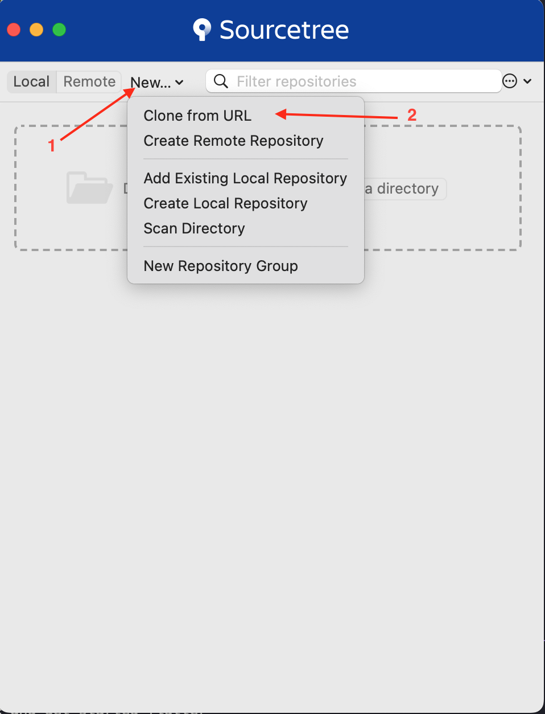

# 🚀 Get Started with Flutter Project

Welcome to the project! Follow these steps to set up your development environment.

---

## 📦 Required Dependencies

Before running the app, make sure you install the following dependencies globally:

- [Flutter SDK](https://docs.flutter.dev/) 3.29.2
- [Dart](https://docs.flutter.dev/) 3.7.2
- [Xcode](https://developer.apple.com/documentation/xcode-release-notes/xcode-16_2-release-notes) 16.2
- [Android Studio](https://androidstudio.googleblog.com/2025/03/android-studio-meerkat-202431-patch-1.html) 
- [Melos](https://melos.invertase.dev/) 6.3.2
- [Java](https://www.oracle.com/java/technologies/javase/jdk17-archive-downloads.html) 17.0.12
- [Cocoapods](https://formulae.brew.sh/formula/cocoapods) 1.16.2

---


## Flutter Version Management (Using Puro)

### Flutter and Dart versions of the project

- Flutter SDK: **_3.29.2_**
- Dart: **_3.7.2_**

### Puro

[Puro](https://puro.dev/) is a powerful tool for installing and upgrading Flutter versions

1. The command line corresponding to the operating system.

   - Mac:
     ```
     curl -o- https://puro.dev/install.sh | PURO_VERSION="1.4.11" bash
     ```
   - Linux:
     ```
     curl -o- https://puro.dev/install.sh | PURO_VERSION="1.4.11" bash
     ```
   - Windows:
     ```
     Invoke-WebRequest -Uri "https://puro.dev/builds/1.4.11/windows-x64/puro.exe" -OutFile "$env:temp\puro.exe"; &"$env:temp\puro.exe" install-puro --promote
     ```

2. Install the package Puro
   ```
   dart pub global activate puro 1.4.11
   puro create e_commerce 3.29.2
   puro use e_commerce
   ```

You need to use `puro flutter ...` everywhere instead of just `flutter ...` when working with the project.

---


## 🔑 Clone the Repository via SSH

```bash
clone git@github.com:kietpham-agilityio/e-commerce.git
```

> If `sshkey` is not setup, see [setup_ssh_key](setup_ssh_key.md)

---

## 🖥️ Using SourceTree (optional)

If you prefer using a GUI like **SourceTree**:

1. Open SourceTree
2. Click "Clone from URL"
3. Paste your SSH URL: `git@github.com:kietpham-agilityio/e-commerce.git`
4. Select destination folder and click "Clone"
5. Make sure SourceTree is using SSH, not HTTPS


---

<!-- ## 🧑‍💻 Recommended Editor Setup (VS Code)

1. Install [VS Code](https://code.visualstudio.com/)
2. Install the following extensions:
   - Flutter
   - Dart
   - Error Lens (optional)
   - GitLens (optional) -->

## 🧑‍💻 Editor Setup

### ✅ VS Code Setup (Recommended)

1. Download and install [VS Code](https://code.visualstudio.com/)

2. Install the following extensions:
   - ✅ Flutter (by Dart-Code)
   - ✅ Dart (by Dart-Code)
   - 💡 Error Lens *(optional – highlight errors inline)*
   - 💡 GitLens *(optional – enhanced Git support)*

3. Enable format on save:
   - Open Settings → search for `format on save` → check ✅

4. Enable organize imports on save:
   - Open Settings → search for `organize imports` → check ✅

5. Recommended `.vscode/settings.json` for project:
   ```json
   {
     "editor.formatOnSave": true,
     "editor.codeActionsOnSave": {
       "source.organizeImports": true
     },
     "dart.lineLength": 100,
     "dart.analysisExcludedFolders": [
       "**/build/**",
       "**/.dart_tool/**"
     ]
   }
   ```

### 🛠 Android Studio Setup

1. Download and install [Android Studio](https://developer.android.com/studio)

2. Open Android Studio → Settings → Plugins:
   - Install: **Flutter Plugin**
   - Install: **Dart Plugin**
   - Restart Android Studio if prompted

3. Setup Android SDK:
   - Go to `Preferences` → `Appearance & Behavior` → `System Settings` → `Android SDK`
   - Install SDK version **34** or higher
   - Make sure `Android SDK Command-line Tools` is also installed

4. Enable Emulator (optional):
   - From **Device Manager**, create an Android Virtual Device (AVD)
   - Choose a Pixel device and a system image with **API 34+**

5. Set up Flutter SDK path:
   - Open a Flutter project or go to Preferences → Languages & Frameworks → Flutter
   - Set SDK path to:
     ```
     ~/.puro/versions/e_commerce
     ```

---

## 🧪 Running the Project

In the project root, run:

```bash
puro flutter pub get
melos bootstrap
puro flutter run
```

> If `melos` is not setup, see [Melos Setup](melos_guide.md)

---

## 📚 Related Docs

- 👉 [Melos Setup Guide](melos_guide.md)
- 👉 [Setup SSH Key](setup_ssh_key.md)

---

Happy coding! 💻✨